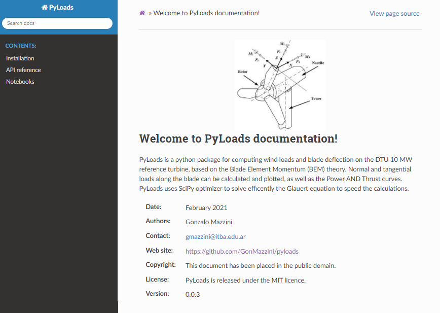

# Python package for calculating the static loads for a wind turbine usgin Blade Element Momentum theory. 

### In version 1.0.0 (end of April) PyLoads will also include code for aeroelastic loads using the unsteady BEM. 

PyLoads is a python package for computing wind loads and blade deflection on the DTU 10 MW reference turbine, based on the Blade Element Momentum (BEM) theory. Normal and tangential loads along the blade can be calculated and plotted, as well as the Power AND Thrust curves. PyLoads uses SciPy optimizer to solve efficently the Glauert equation to speed the calculations.

# note: The Web Documentation of the project is still in progress (will be finished by end of May latest)

## The DTU 10 MW is used as example for computing:
- Normal and tangential loads
- Power coefficient
- Thrust coefficient
- Power curve plot for WTG.

